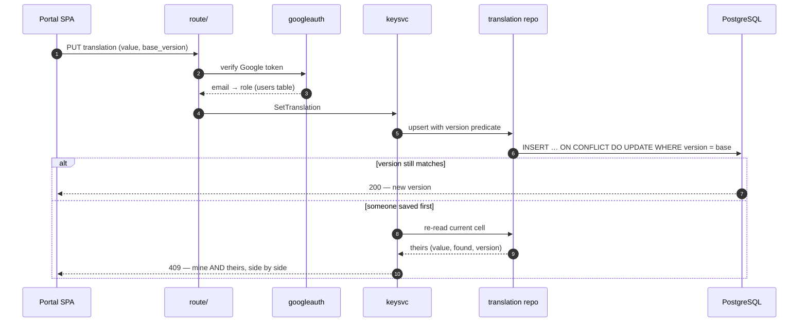
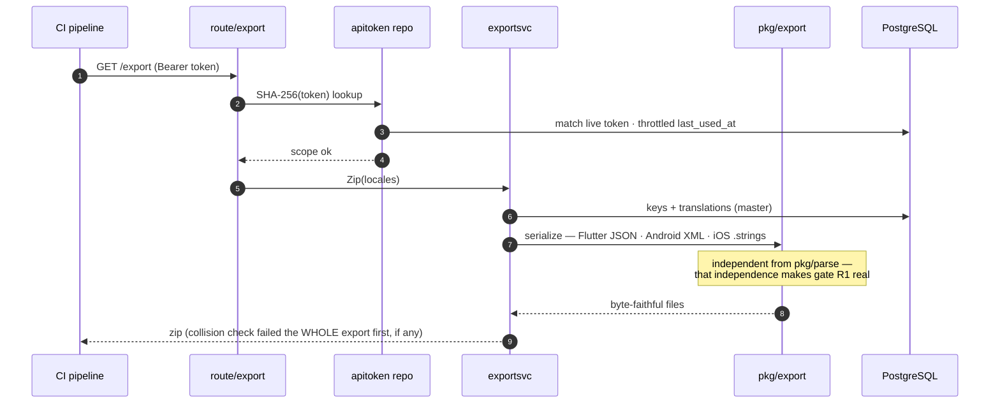
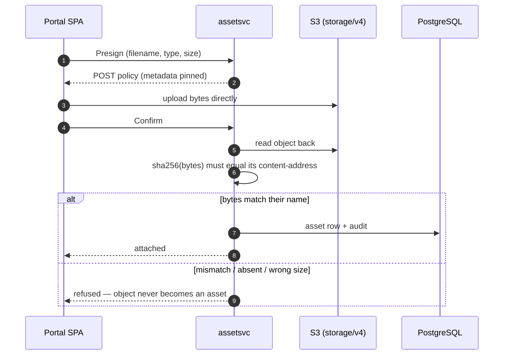
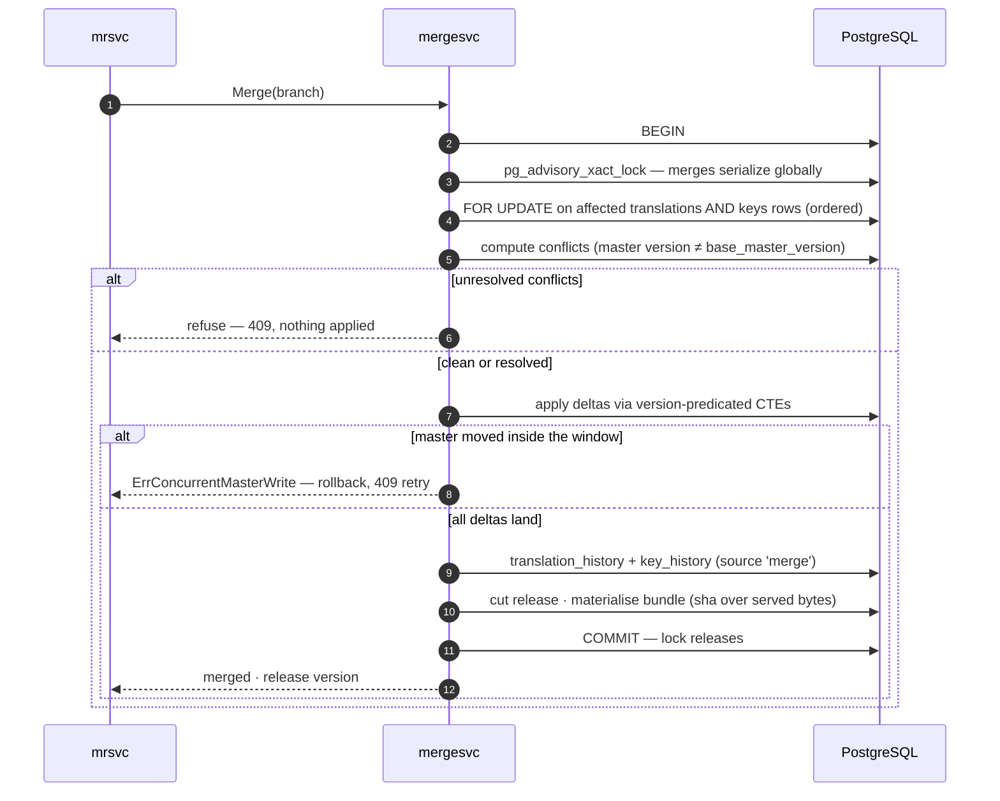
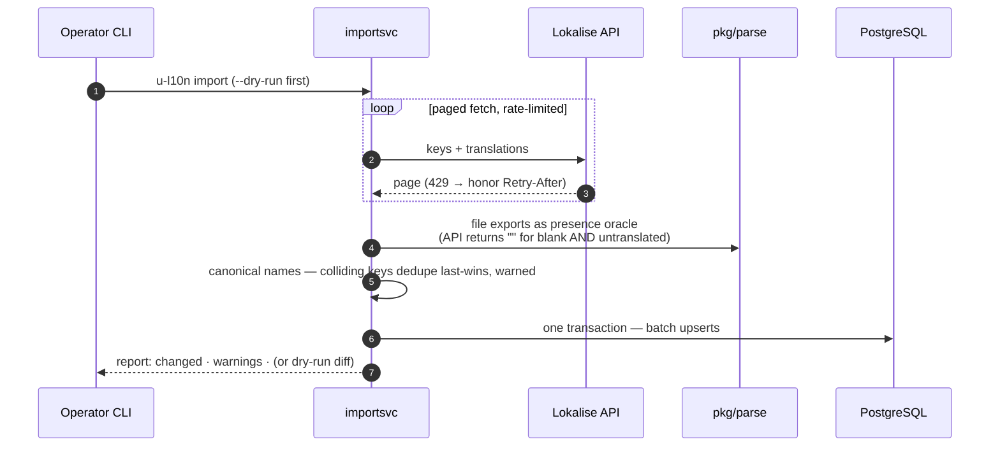

# u-l10n — how it fits together

The machinery view, one sequence per flow. For the persona journeys — translator, reviewer, mobile app, operator — see [USER_FLOWS.md](USER_FLOWS.md).

Layering rule behind every diagram: `route/` decodes and maps errors to status codes → `pkg/service/` decides and owns the transaction → `pkg/repository/` speaks SQL → PostgreSQL. Repositories never open their own transaction; values always travel as `(value, found)` — absent and empty are different states.

## 1. Portal write — saving a translation

## 2. Authenticated export — CI pulls the three formats

## 3. Asset upload — a context screenshot reaches S3

## 4. The merge transaction — seven steps, one lock

## 5. Import — reconciling from Lokalise

