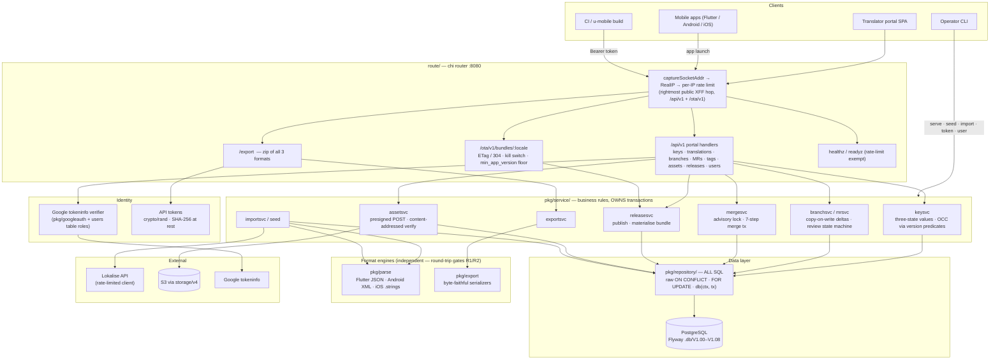
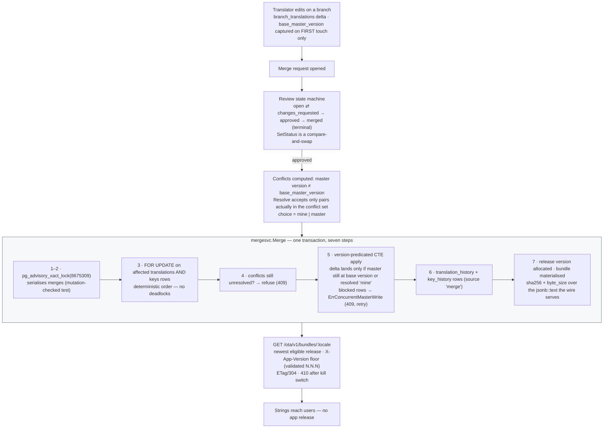

# u-l10n — how it fits together

The machinery view. For the persona journeys — translator, reviewer, mobile app, operator — see [USER_FLOWS.md](USER_FLOWS.md).

## 1. Architecture & request flow

## 2. The life of a copy change — branch → merge → OTA

### Reading guide

- **Three states everywhere:** no row = untranslated (omitted from export), `''` = deliberately blank (exported as `""`), else translated. Repositories return `(value, found, err)` — never a bare string.
- **`pkg/parse` and `pkg/export` never import each other** — that independence is what makes gate R1 (98,320 values round-tripped, zero alterations) a real check instead of a tautology.
- **Services own transactions; repositories take `tx` and speak SQL.** `WithTransaction` does not nest.
- **The advisory lock serialises merge-vs-merge; the version-predicated applies (step 5) close portal-vs-merge races** — two different mechanisms, both mutation-verified.
