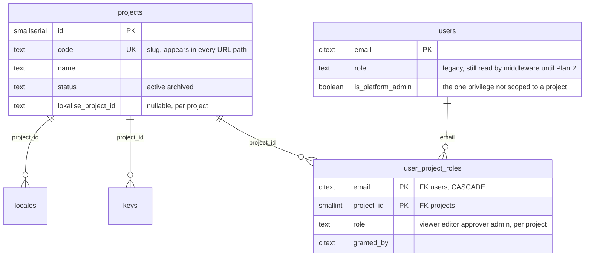
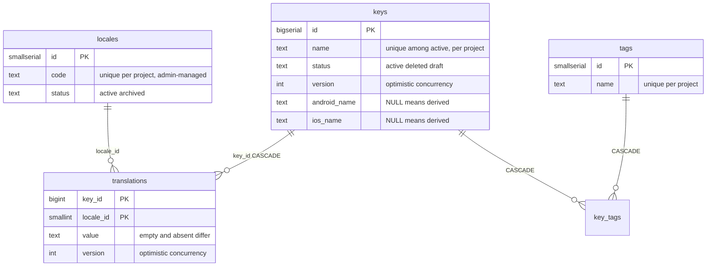
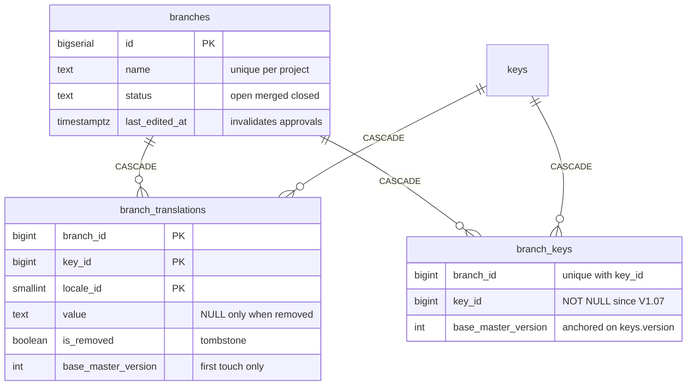
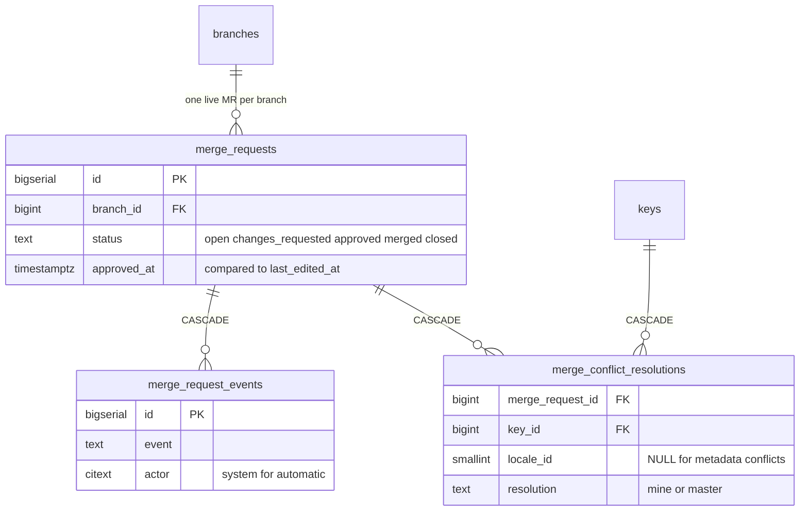
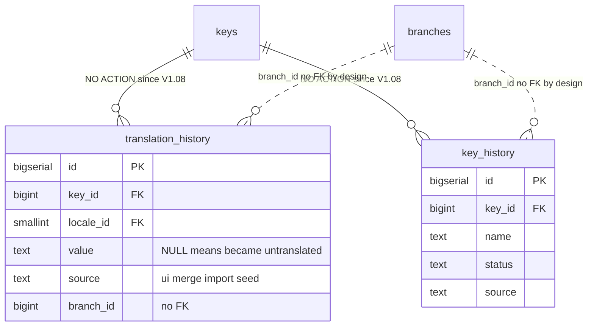
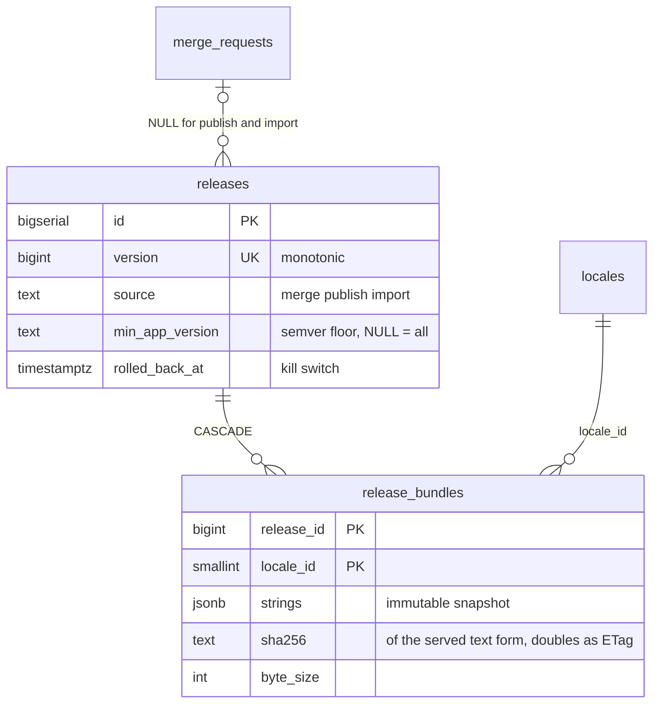
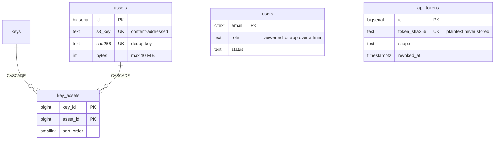

# u-l10n — data model

The schema, its invariants, and why each table exists. Derived from `.db/V1.00`–`V1.08` and `pkg/repository/`. For the request flows over this schema see [ARCHITECTURE.md](ARCHITECTURE.md).

One sentence version: `keys × locales → translations` is the master matrix, branches overlay deltas on it, merges fold deltas back and cut an immutable release, and everything a human does lands in an append-only history.

## 1. Schema at a glance

### Projects and roles

**The root everything else hangs from.** `projects` was added in V1.09 as a single YouTrip row with an explicit id of 1; V1.10–V1.13 then added `project_id` to every table that used to be implicitly YouTrip-only — `locales`, `keys`, `translations`, `tags`, `key_tags`, `branches` and its delta tables, `merge_requests`, `releases`, `release_bundles`, `assets`, `key_assets`, `api_tokens`, `audit_events`, `import_runs`, `project_settings`, `translation_history`, `key_history` — pairing each with the corresponding parent through a composite `(project_id, id)` foreign key so a row can no longer reference another project's key, locale or branch by mistake (see §2 for why this needs a composite key rather than a plain one). Every one of those columns still carries a temporary `DEFAULT 1`, dropped only once every write path passes its project explicitly.

**Identity and authorization split in V1.13.** `users` answers *who* (one row per person, keyed on email); `user_project_roles` answers *what they may do, on which project* — the same viewer/editor/approver/admin ordering as before, just no longer a single column on `users`. `users.role` is deliberately still present and still read by the request middleware; it is retired only once every lookup goes through `user_project_roles` instead. `is_platform_admin` is the one privilege that is not scoped to any project — minting a new project, and granting its creator the first role on it, cannot itself be gated by a per-project role that does not exist yet.

### The master copy

**The master copy.** One row per translated `(key, locale)` pair — no row at all means untranslated, and that difference is load-bearing. Everything else in the schema exists to change these two tables safely. Every entity on this diagram also carries a `project_id` (see "Projects and roles" above); it is omitted here to keep the (key, locale, value) relationship the one thing this diagram shows.

### Branch copy-on-write

**Deltas, not copies.** A branch stores only what it changed; `base_master_version` records where each delta started (0 = no master row existed) and is deliberately never refreshed — refreshing it would make a genuine conflict look clean.

### Merge requests

### Append-only history

**An audit record survives whatever it describes.** Dotted lines are deliberate non-FKs; since V1.08 the key FKs refuse a hard delete rather than cascading the trail away.

### Releases and OTA bundles

### Assets and accounts

`users` and `api_tokens` stand alone by design — identity is email-keyed, tokens are hash-keyed. The remaining operational tables (`audit_events`, `import_runs`, `project_settings`) are free-standing append/config tables; see the entity reference below.

Standalone tables with no relationships: `users`, `api_tokens`, `audit_events`, `import_runs`, `project_settings` — see §3.

## 2. The invariants the schema encodes

**A (key, locale) pair has three states, not two.** No `translations` row = untranslated, omitted from exports. `value = ''` = deliberately blank, exported as `""`. Anything else = translated. Collapsing absent into empty adds ~430 spurious keys to en-SG; collapsing empty into absent deletes 3,664 intentional blanks from ms-MY. This is why `pkg/repository/export.go` reads with a LEFT JOIN and returns `(value, found)`, and why no repository method ever returns a bare string.

**Optimistic concurrency lives in `version` columns and in the WHERE clause of the statement that writes.** `translations.version` and `keys.version` start at 1 and bump on every real change. The predicates:

- `translation.go` `updateWithVersionSQL` — `WHERE … AND version = $expected`, zero rows affected is the 409.
- `key.go` update/soft-delete — `AND ($n = 0 OR k.version = $n)`, 0 meaning "caller opted out of the check".
- `translation.go` upserts guard with `WHERE … IS DISTINCT FROM EXCLUDED.…` so a re-run of the idempotent importer does not bump versions and hand a spurious 409 to every open editor.
- `mergerequest.go` apply CTEs re-check `COALESCE(master.version, 0) = base_master_version OR resolution = 'mine'` inside the writing statement itself; deltas that are neither applicable nor an intentional skip count as `blocked` and abort the merge.

**`base_master_version` is captured on first touch only.** `branch.go` `setValueSQL` writes it on INSERT and the `ON CONFLICT` branch deliberately does not update it — it records where the branch started, not what it has done since. `0` means no master row existed, so the entire value-conflict rule is one comparison: `COALESCE(master.version, 0) <> base_master_version → conflict`, covering edit/edit, create/create, remove/edit and edit/delete races. Refreshing it would let a branch adopt master's newer version as its base and make a genuine conflict look clean.

**Branches are copy-on-write.** A branch never copies master's ~36,000 values. `branch_translations` and `branch_keys` hold only deltas; every read resolves as *delta row if present, else master row*. `is_removed` is a tombstone — a third state distinct from `value = ''` and from having no delta at all, enforced by the CHECK that a removal carries no value and a non-removal must carry one. A key created on a branch is inserted into `keys` immediately as `status = 'draft'` (invisible to every export and bundle, which filter `status = 'active'`) plus an ordinary `branch_keys` delta carrying `'active'`; the merge promotes it through the same metadata path as any other delta (V1.07).

**Keys soft-delete.** `DELETE` on the API is `status = 'deleted'`. The partial unique index `idx_keys_name_active` (`ON keys (project_id, name) WHERE status = 'active'` since V1.10) means uniqueness applies only among the living, within a project — soft-deleting `login_button` does not block that name forever, and a second project may reuse it immediately. Writers target the index directly: `ON CONFLICT (project_id, name) WHERE status = 'active'` (`key.go:165,513`).

**History is append-only.** A rollback is a new forward write (`source = 'rollback'`), never a delete or update: the timeline reads v1 → v2 → v3 → v2′. `translation_history.value` is nullable to distinguish "became untranslated" from "became empty". As of V1.08 the `key_id` FKs are plain NO ACTION — a hard delete of a key that still has history is refused, not cascaded, because the only path to such a delete is a hand-typed `DELETE` in psql, precisely the moment the audit trail matters most. `branch_id` has no FK at all: an audit record must survive whatever happens to the thing it describes, and a constraint that could block a write or null a column is the wrong tool on an append-only table. (`translations` keeps its cascade — a value is content, not audit.)

**Releases are immutable snapshots; bundles are the serving truth.** Every merge cuts a release and materialises every locale's bundle in the same transaction, so the export and OTA endpoints are read-only handlers that cannot disagree. `sha256` is computed in SQL over `(strings::jsonb)::text` — the same bytes the OTA path serves — not over Go's `json.Marshal` output, so a client checksumming its download matches (`release.go` `materialiseBundleSQL`). It doubles as the HTTP ETag. Rollback is a kill switch (`rolled_back_at`), not a delete; `min_app_version` is a semver floor compared as an integer triple, never lexically.

**Assets are content-addressed.** `sha256` is unique and the S3 key embeds it (`screenshots/<aa>/<bb>/<sha256>.<ext>`): re-uploading identical bytes reuses the row, and the name *is* the content, so an asset is immutable by construction. The bucket is private — screenshots of a fintech app carry customer PII — and asset views are audited.

## 3. Entity reference

### Projects and roles (V1.09, V1.13)

**`projects`** — the root of the ownership tree; every locale, key, branch and release belongs to exactly one. `code` is a slug (CHECK `^[a-z][a-z0-9-]{1,31}$`) because it appears in every URL path (`/projects/{project}/…`). Archived, never deleted — releases, history and audit rows reference it. YouTrip is seeded with the explicit id `1`; every `project_id` column added by V1.10–V1.13 defaults to it temporarily (see the "Projects and roles" diagram above), so a project is minted through the `projectsvc.Create` API/CLI path, never a migration.

| Column | Type | Constraints / meaning |
|---|---|---|
| `id` | SMALLSERIAL | PK |
| `code` | TEXT | UNIQUE, slug format |
| `name` | TEXT | display name |
| `status` | TEXT | CHECK in (active, archived) |
| `lokalise_project_id` | TEXT | nullable — a project need not import from Lokalise |

**`user_project_roles`** — added in V1.13 to split *who* (`users`) from *what they may do, on which project*. PK `(email, project_id)`; `role` CHECK in the same ordered set `users.role` used to hold alone (viewer < editor < approver < admin); `email` FK `users (email)` ON DELETE CASCADE; `project_id` FK `projects (id)`; `granted_by` records the actor for the same reason every other grant in this schema does. `users.role` is not yet dropped — the request middleware still reads it — so for now the two describe the same access twice; Plan 2 retires the column once nothing reads it. `users.is_platform_admin` is the one privilege this table cannot express: creating a project, and granting its creator the first row here, needs a privilege that is not itself scoped to a project.

### Locales, keys, translations (V1.00, rescoped V1.10)

**`locales`** — the locale dimension; each row owns its export directory naming so serializers stay table-driven and a seventh locale is an INSERT, not a code change. As of V1.10 locales are **admin-managed data, not migration-seeded reference data**: `LocaleRepository.Create`/`Update` (`pkg/repository/locale.go`), exposed as `POST /projects/{project}/locales` and `PATCH /projects/{project}/locales/{code}`, are how a project gains or reconfigures a locale at runtime. Adding one writes no `translations` rows — absent means untranslated (see §2) — which is what makes an arbitrary locale count cheap. There is no delete: `status` is the only lifecycle move, because `translations` and history reference the row.

| Column | Type | Constraints / meaning |
|---|---|---|
| `id` | SMALLSERIAL | PK |
| `project_id` | SMALLINT | FK projects; UNIQUE with `id` (composite FK target for `translations` etc.) |
| `code` | TEXT | UNIQUE **per project** (`UNIQUE (project_id, code)`), e.g. `en-SG` — two projects may each define their own |
| `flutter_dir`, `android_values_dir`, `ios_lproj` | TEXT | export directory names per platform, from u-mobile's `run.sh`; each UNIQUE **per project** (V1.10) so two locales on one project cannot collide on the same export path |
| `sort_order` | SMALLINT | display order |
| `status` | TEXT | CHECK in (active, archived); added V1.10 — see above |

**`keys`** — one translatable string identifier, scoped to a project since V1.10 (`project_id` FK, `UNIQUE (project_id, id)`; `lokalise_key_id` UNIQUE **per project**, since each project imports from its own Lokalise project).

| Column | Type | Constraints / meaning |
|---|---|---|
| `id` | BIGSERIAL | PK |
| `project_id` | SMALLINT | FK projects |
| `name` | TEXT | unique **among active, per project** (partial index) |
| `description` | TEXT | default `''` |
| `platforms` | TEXT[] | CHECK ⊆ {flutter, android, ios}, non-empty |
| `android_name`, `ios_name` | TEXT | NULL = derive from `name`; non-NULL = deliberate override — a distinction unrecoverable if materialised |
| `status` | TEXT | CHECK in (active, deleted, draft) |
| `version` | INT | optimistic-concurrency anchor, CHECK > 0 |
| `sort_index` | BIGINT | export order is data — must reproduce Lokalise's ordering; seeded with gaps, new keys get max+100 |
| `lokalise_key_id` | BIGINT | UNIQUE per project, import provenance |

**`translations`** — the key × locale value matrix; presence and content are separate facts. Also carries `project_id` (V1.10); its `key_id`/`locale_id` FKs became the composite `(project_id, key_id) → keys (project_id, id)` and `(project_id, locale_id) → locales (project_id, id)` so a translation cannot pair a key with another project's locale.

| Column | Type | Constraints / meaning |
|---|---|---|
| `key_id` | BIGINT | PK part, FK keys ON DELETE CASCADE |
| `locale_id` | SMALLINT | PK part, FK locales |
| `project_id` | SMALLINT | denormalized onto every row so the composite FKs above can target it directly |
| `value` | TEXT | NOT NULL — `''` is a real, deliberate state |
| `render_hint` | TEXT | CHECK in (plain, cdata); per-value, not per-key |
| `version` | INT | optimistic-concurrency anchor, CHECK > 0 |
| `updated_by` | CITEXT | |

### Tags (V1.01, rescoped V1.10)

**`tags`** / **`key_tags`** — workflow metadata, deliberately global per key rather than branch-scoped: keeping tags out of branch scope keeps them out of conflict computation and the merge transaction entirely. Both carry `project_id` since V1.10; `tags.name` UNIQUE **per project**; `key_tags` PK `(key_id, tag_id)` plus `project_id`, both FKs CASCADE via the composite `(project_id, key_id|tag_id)` form. `colour` is captured manually from Lokalise's UI (its API does not expose it).

### History (V1.01, amended V1.08, rescoped V1.13)

**`translation_history`** / **`key_history`** — insert-only answers to "who changed the customer-facing text that caused the complaint". Both carry the post-change state plus `version`, `source` (CHECK in ui, merge, import, rollback, api), nullable `branch_id` (no FK — NULL means master), `changed_by`, `changed_at`, and (since V1.13) `project_id`. `translation_history.value` NULL means "became untranslated". `key_id` FKs are composite (`project_id, key_id`) and NO ACTION since V1.08 (see §2).

### Branches, merge requests, resolutions (V1.02, amended V1.07, rescoped V1.11)

**`branches`** — a named copy-on-write workspace, scoped to a project since V1.11 (`project_id` FK). `name` UNIQUE **per project** rather than globally, so two projects may each run a branch called `q3-copy`. `status` CHECK in (open, merged, closed). `last_edited_at` bumps on any write; the merge compares it against `merge_requests.approved_at` so an approval invalidated by later edits cannot merge.

**`branch_translations`** — value deltas. PK `(branch_id, key_id, locale_id)` plus `project_id`; `value` NULL iff `is_removed` (CHECK); `base_master_version ≥ 0`, captured on first touch (see §2). FKs to `branches`/`keys`/`locales` are all composite on `project_id` since V1.11, so a delta cannot name another project's key or locale.

**`branch_keys`** — metadata deltas. `key_id` NOT NULL since V1.07 (the nullable "key not yet on master" state could never carry a value and the merge silently dropped it); unique `(branch_id, key_id)` and `(branch_id, name)`; same `base_master_version` semantics, anchored on `keys.version`; `project_id` and composite FKs since V1.11.

**`merge_requests`** — the review gate. `status` CHECK in (open, approved, changes_requested, rejected, merged, closed); partial unique index allows at most one **live** MR per branch, so a rejected branch can reopen with a fresh one. Carries `project_id` directly (V1.11) rather than only reachable through its branch, because the merge transaction filters on it and the advisory lock is derived from it.

**`merge_request_events`** — append-only MR timeline; `actor = 'system'` for automatic transitions such as `approval_invalidated`. Event CHECK in (created, approved, changes_requested, rejected, reopened, closed, merged, approval_invalidated).

**`merge_conflict_resolutions`** — stored human decisions (`mine` | `master`); the merge refuses to proceed while any detected conflict lacks one, because auto-resolving silently chooses one person's words over another's. `locale_id` NULL for key-metadata conflicts; uniqueness via expression index on `(merge_request_id, key_id, COALESCE(locale_id, -1))`, which the repository's `ON CONFLICT` targets verbatim. `project_id` and composite `key`/`locale` FKs since V1.11.

### Releases and bundles (V1.03, rescoped V1.12)

**`releases`** — an immutable snapshot cut by every merge (or manual publish / import), scoped to a project since V1.12. `version` is now UNIQUE **per project** (`UNIQUE (project_id, version)`), but the *allocation* has not caught up to the constraint yet: `createReleaseSQL`/`createPublishSQL` in `pkg/repository/release.go` still compute `COALESCE((SELECT max(version) FROM releases), 0) + 1` with no `project_id` predicate, so today a second project's first release would still take the first project's max+1, not restart at 1. Scoping that allocation query is outstanding work tracked separately from this constraint. `source` CHECK in (merge, publish, import); `merge_request_id` nullable FK; `rolled_back_at`/`rolled_back_by` set together or not at all (CHECK) — the OTA kill switch, after which clients receive 410 and fall back to bundled strings.

**`release_bundles`** — one row per (release, locale), plus `project_id` and composite FKs since V1.12. `strings` JSONB is the flat key → value map for the flutter platform with empty values included — structurally identical to `assets/langs/<locale>.json` in the mobile repo, so OTA payload and bundled asset cannot drift. `sha256` CHECK `^[0-9a-f]{64}$`, computed over the served text form (see §2); `key_count`, `byte_size` ≥ 0.

### Assets (V1.04, rescoped V1.12)

**`assets`** — context screenshots for translators; portal-only, never exported, never in a bundle. Content-addressed **per project** since V1.12 (`s3_key` and `sha256` UNIQUE per `project_id`, not globally); `content_type` CHECK in (png, jpeg, webp) and `bytes ∈ (0, 10 MiB]` as the database-level last line of defence against direct API calls. The S3 key itself does not yet carry a project prefix — `assetsvc.s3Key()` catching up is `TODO(plan-2)` — so two projects uploading identical bytes today produce two correctly-distinguished rows that alias the same S3 object.

**`key_assets`** — many-to-many by design: one screenshot of a screen gives context for every string on it. Global per key, not branch-scoped — the same call as tags. Carries a free-text `note` and `sort_order`, plus `project_id` and composite FKs since V1.12.

### Users, roles and API tokens (V1.05, split V1.13)

**`users`** — u-l10n owns its own role model, keyed on `email CITEXT` (case-insensitivity by type, not by remembering `LOWER()`), deliberately not derived from the portal's Google Workspace groups. `status` CHECK in (active, disabled). `role` is the pre-V1.13 single global role and is still what the request middleware reads; per-project access now lives in `user_project_roles` (see "Projects and roles" above) and this column is retired once the middleware catches up. `is_platform_admin` (V1.13) is the one privilege with no project to scope it to.

**`api_tokens`** — for scripts and CI, not humans; scoped to a project since V1.13 (`project_id` FK) so one project's CI cannot pull another's export with a leaked token. Only the SHA-256 of the token is stored (a dump hands over no credentials); `token_prefix` is the recognisable `ul10n_a3f9…` shown in lists; the full token is shown exactly once. `scope` CHECK in (read_export, read_write); `revoked_at`/`revoked_by` set together (CHECK); nullable `expires_at`. Authentication (`apitoken.go`) resolves not-revoked, not-expired by hash, returns the same `ErrNotFound` for wrong, revoked and expired tokens so probing enumerates nothing, and throttles the `last_used_at` write to once a minute inside the UPDATE's own predicate.

### Operational (V1.06, rescoped V1.13)

**`audit_events`** — actions rather than value changes: admin direct-edits, role grants, token creation, merges, and asset views (audited deliberately — the images contain customer PII). Carries `project_id` since V1.13. `target` is a free-form reference (`key:1234`, `branch:copy-fixes`) and deliberately not a FK: an audit record must outlive whatever it describes. `metadata` JSONB, `request_id` for correlation.

**`import_runs`** — one row per Lokalise import attempt, dry runs included, plus `project_id` since V1.13; the importer is idempotent and resumable, and this table is how you tell what a run did. `status` CHECK in (running, succeeded, failed, rolled_back); counters CHECK ≥ 0; `warnings` JSONB for non-fatal observations.

**`project_settings`** — key/value JSONB configuration editable at runtime by an admin, as opposed to env-var configuration that needs a deploy. PK moved from `key` alone to `(project_id, key)` in V1.13 — the table was named for exactly this and only ever held one project's settings until then. Kept minimal on purpose.

## 4. Indexes and the hot paths they back

| Index | Backs |
|---|---|
| `idx_releases_servable` — `(project_id, version DESC) WHERE rolled_back_at IS NULL` | OTA lookup: `servableBundleSQL` in `release.go` orders `version DESC LIMIT 1` with `rolled_back_at IS NULL`, now within one project — leading with `project_id` (V1.12) is necessary because the query also filters on it; without that leading column the index alone cannot satisfy `ORDER BY version DESC` once a second project's rows are interleaved with the first's. `release_bundles` PK covers the join. |
| `idx_api_tokens_live` — `(token_sha256) WHERE revoked_at IS NULL` | Token auth on every scripted request: `authenticateSQL` filters `token_sha256 = $1 AND revoked_at IS NULL`. |
| `idx_keys_sort_index` — `(sort_index) WHERE status = 'active'` | Key browse and export: `forExportSQL` and the key list both filter `status = 'active'` and `ORDER BY sort_index`. |
| `idx_keys_name_active` — unique `(project_id, name) WHERE status = 'active'` | Name lookup and uniqueness among the living, now per project; the `ON CONFLICT (project_id, name) WHERE status = 'active'` target in `key.go` follows suit. |
| `idx_keys_project_status_name` — `(project_id, status, name)` (V1.10, replacing `idx_keys_status_name`) | The key browse leads with `project_id` because it is now the busiest query's first filter. |
| `idx_keys_platforms` — GIN on `platforms` | `$x = ANY(k.platforms)` filters in export and browse. |
| `translations` PK `(key_id, locale_id)` + `idx_translations_locale_id` | Cell reads/upserts by pair; whole-locale scans for export and bundle materialisation. |
| `idx_branch_translations_key_locale` — `(key_id, locale_id)` | The reverse direction of copy-on-write resolution: given master rows, find overlaying deltas (merge locking, branch-aware search in `key.go`). PK `(branch_id, …)` serves the branch-first direction. |
| `idx_translation_history_key_locale`, `idx_key_history_key_id` — `(…, changed_at DESC)` | Per-cell and per-key history timelines, newest first. |
| `idx_merge_requests_one_live_per_branch` — partial unique | Both the "one live MR" invariant and the branch → live-MR lookup. |
| `idx_audit_events_created_at` / `_actor` / `_target` | Audit browsing by time, person, and subject. |
| `idx_import_runs_started_at` | Import run listing, newest first. |
| `idx_key_tags_tag_id`, `idx_key_assets_asset_id` | Reverse traversal of the two m:n tables (keys for a tag, keys for an asset). |

## 5. Migration conventions

- Flyway, files in `.db/`, named `V1.NN__description.sql` with a **zero-padded** minor so lexical order and version order agree.
- Forward-only in practice. The paired `U1.NN__` undo files are **documentation only** and are never executed — Flyway Community cannot run `undo`.
- Enum-like columns are `TEXT + CHECK`, not native ENUMs: a CHECK is dropped and recreated in an ordinary transactional migration, `ALTER TYPE` is not.
- Migrations carry their reasoning in comments; V1.07 and V1.08 are pure invariant-tightening migrations (a NOT NULL and two FK behaviour changes) with no data migration — deliberately, so an unexpected state fails the migration and a human looks at it rather than a script quietly deleting it.
