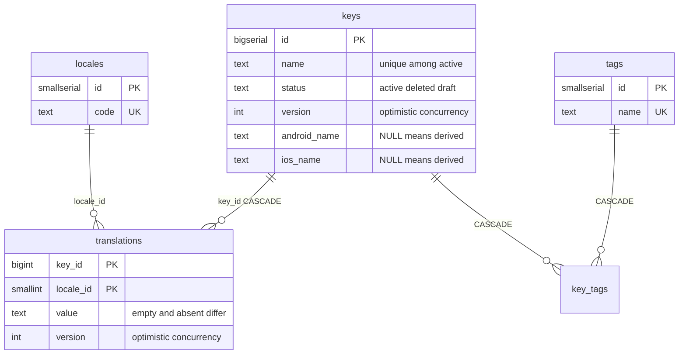
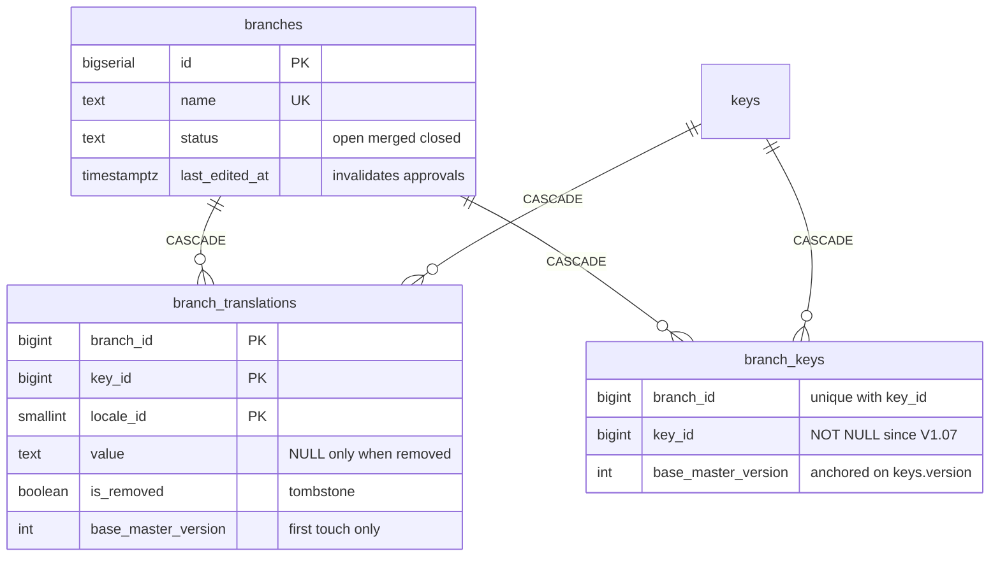
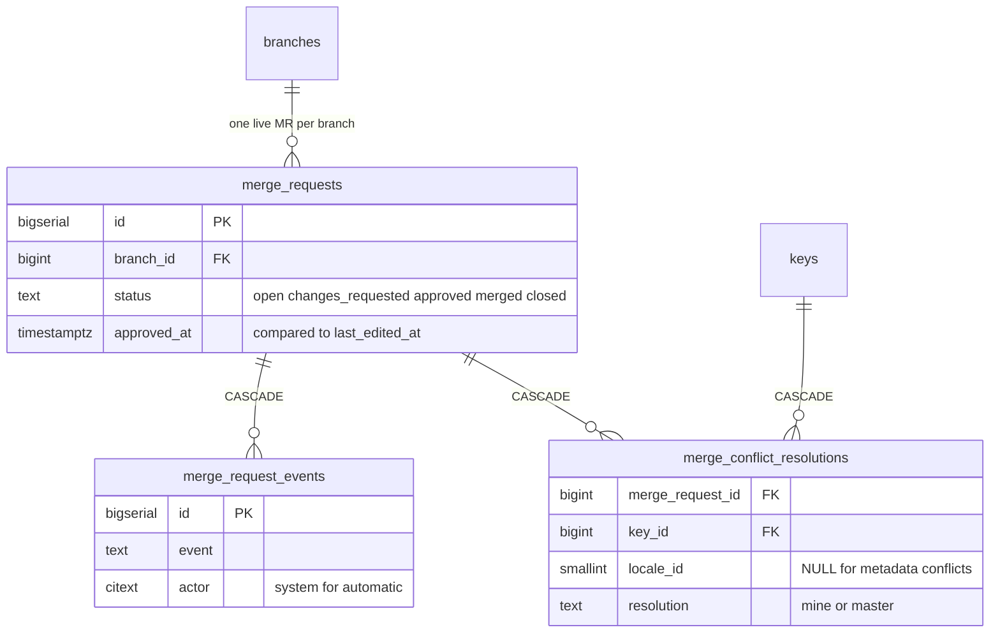
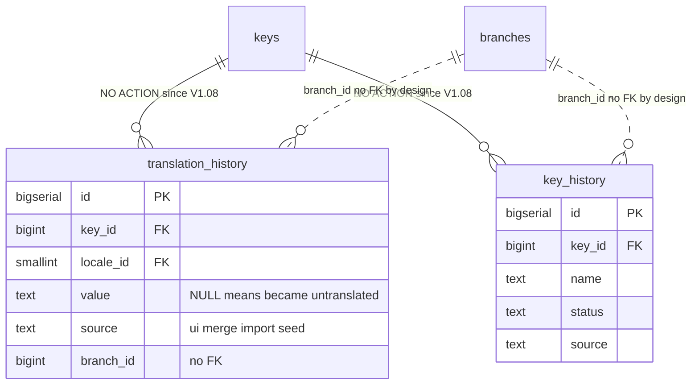
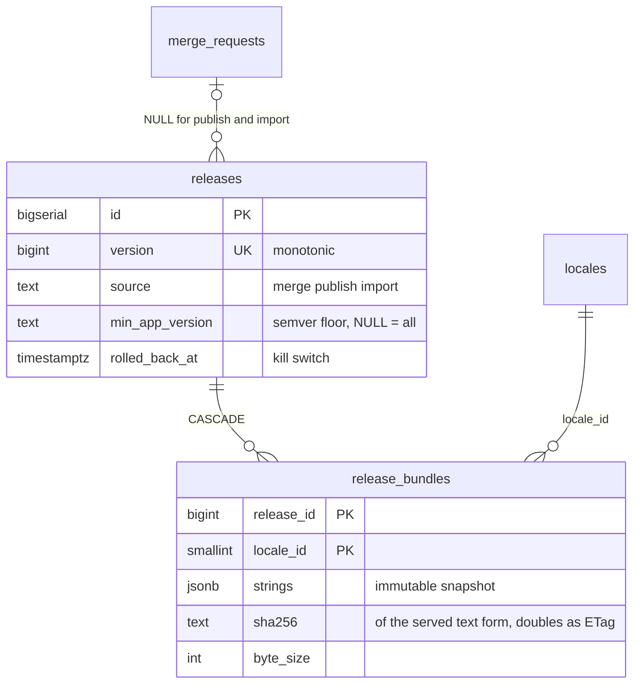
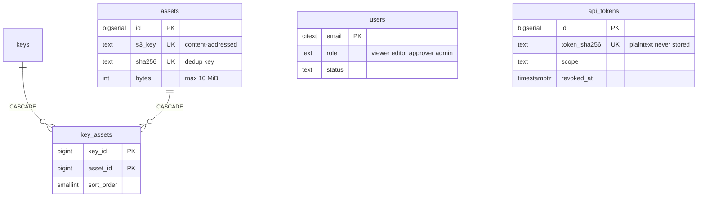

# u-l10n — data model

The schema, its invariants, and why each table exists. Derived from `.db/V1.00`–`V1.08` and `pkg/repository/`. For the request flows over this schema see [ARCHITECTURE.md](ARCHITECTURE.md).

One sentence version: `keys × locales → translations` is the master matrix, branches overlay deltas on it, merges fold deltas back and cut an immutable release, and everything a human does lands in an append-only history.

## 1. Schema at a glance

### The master copy

**The master copy.** One row per translated `(key, locale)` pair — no row at all means untranslated, and that difference is load-bearing. Everything else in the schema exists to change these two tables safely.

### Branch copy-on-write

**Deltas, not copies.** A branch stores only what it changed; `base_master_version` records where each delta started (0 = no master row existed) and is deliberately never refreshed — refreshing it would make a genuine conflict look clean.

### Merge requests

### Append-only history

**An audit record survives whatever it describes.** Dotted lines are deliberate non-FKs; since V1.08 the key FKs refuse a hard delete rather than cascading the trail away.

### Releases and OTA bundles

### Assets and accounts

`users` and `api_tokens` stand alone by design — identity is email-keyed, tokens are hash-keyed. The remaining operational tables (`audit_events`, `import_runs`, `project_settings`) are free-standing append/config tables; see the entity reference below.

Standalone tables with no relationships: `users`, `api_tokens`, `audit_events`, `import_runs`, `project_settings` — see §3.

## 2. The invariants the schema encodes

**A (key, locale) pair has three states, not two.** No `translations` row = untranslated, omitted from exports. `value = ''` = deliberately blank, exported as `""`. Anything else = translated. Collapsing absent into empty adds ~430 spurious keys to en-SG; collapsing empty into absent deletes 3,664 intentional blanks from ms-MY. This is why `pkg/repository/export.go` reads with a LEFT JOIN and returns `(value, found)`, and why no repository method ever returns a bare string.

**Optimistic concurrency lives in `version` columns and in the WHERE clause of the statement that writes.** `translations.version` and `keys.version` start at 1 and bump on every real change. The predicates:

- `translation.go` `updateWithVersionSQL` — `WHERE … AND version = $expected`, zero rows affected is the 409.
- `key.go` update/soft-delete — `AND ($n = 0 OR k.version = $n)`, 0 meaning "caller opted out of the check".
- `translation.go` upserts guard with `WHERE … IS DISTINCT FROM EXCLUDED.…` so a re-run of the idempotent importer does not bump versions and hand a spurious 409 to every open editor.
- `mergerequest.go` apply CTEs re-check `COALESCE(master.version, 0) = base_master_version OR resolution = 'mine'` inside the writing statement itself; deltas that are neither applicable nor an intentional skip count as `blocked` and abort the merge.

**`base_master_version` is captured on first touch only.** `branch.go` `setValueSQL` writes it on INSERT and the `ON CONFLICT` branch deliberately does not update it — it records where the branch started, not what it has done since. `0` means no master row existed, so the entire value-conflict rule is one comparison: `COALESCE(master.version, 0) <> base_master_version → conflict`, covering edit/edit, create/create, remove/edit and edit/delete races. Refreshing it would let a branch adopt master's newer version as its base and make a genuine conflict look clean.

**Branches are copy-on-write.** A branch never copies master's ~36,000 values. `branch_translations` and `branch_keys` hold only deltas; every read resolves as *delta row if present, else master row*. `is_removed` is a tombstone — a third state distinct from `value = ''` and from having no delta at all, enforced by the CHECK that a removal carries no value and a non-removal must carry one. A key created on a branch is inserted into `keys` immediately as `status = 'draft'` (invisible to every export and bundle, which filter `status = 'active'`) plus an ordinary `branch_keys` delta carrying `'active'`; the merge promotes it through the same metadata path as any other delta (V1.07).

**Keys soft-delete.** `DELETE` on the API is `status = 'deleted'`. The partial unique index `idx_keys_name_active` (`ON keys (name) WHERE status = 'active'`) means uniqueness applies only among the living — soft-deleting `login_button` does not block that name forever. Writers target the index directly: `ON CONFLICT (name) WHERE status = 'active'`.

**History is append-only.** A rollback is a new forward write (`source = 'rollback'`), never a delete or update: the timeline reads v1 → v2 → v3 → v2′. `translation_history.value` is nullable to distinguish "became untranslated" from "became empty". As of V1.08 the `key_id` FKs are plain NO ACTION — a hard delete of a key that still has history is refused, not cascaded, because the only path to such a delete is a hand-typed `DELETE` in psql, precisely the moment the audit trail matters most. `branch_id` has no FK at all: an audit record must survive whatever happens to the thing it describes, and a constraint that could block a write or null a column is the wrong tool on an append-only table. (`translations` keeps its cascade — a value is content, not audit.)

**Releases are immutable snapshots; bundles are the serving truth.** Every merge cuts a release and materialises every locale's bundle in the same transaction, so the export and OTA endpoints are read-only handlers that cannot disagree. `sha256` is computed in SQL over `(strings::jsonb)::text` — the same bytes the OTA path serves — not over Go's `json.Marshal` output, so a client checksumming its download matches (`release.go` `materialiseBundleSQL`). It doubles as the HTTP ETag. Rollback is a kill switch (`rolled_back_at`), not a delete; `min_app_version` is a semver floor compared as an integer triple, never lexically.

**Assets are content-addressed.** `sha256` is unique and the S3 key embeds it (`screenshots/<aa>/<bb>/<sha256>.<ext>`): re-uploading identical bytes reuses the row, and the name *is* the content, so an asset is immutable by construction. The bucket is private — screenshots of a fintech app carry customer PII — and asset views are audited.

## 3. Entity reference

### Locales, keys, translations (V1.00)

**`locales`** — the locale dimension; each row owns its export directory naming so serializers stay table-driven and a seventh locale is an INSERT, not a code change. Seeded with six rows.

| Column | Type | Constraints / meaning |
|---|---|---|
| `id` | SMALLSERIAL | PK |
| `code` | TEXT | UNIQUE, e.g. `en-SG` |
| `flutter_dir`, `android_values_dir`, `ios_lproj` | TEXT | export directory names per platform, from u-mobile's `run.sh` |
| `sort_order` | SMALLINT | display order |

**`keys`** — one translatable string identifier.

| Column | Type | Constraints / meaning |
|---|---|---|
| `id` | BIGSERIAL | PK |
| `name` | TEXT | unique **among active** (partial index) |
| `description` | TEXT | default `''` |
| `platforms` | TEXT[] | CHECK ⊆ {flutter, android, ios}, non-empty |
| `android_name`, `ios_name` | TEXT | NULL = derive from `name`; non-NULL = deliberate override — a distinction unrecoverable if materialised |
| `status` | TEXT | CHECK in (active, deleted, draft) |
| `version` | INT | optimistic-concurrency anchor, CHECK > 0 |
| `sort_index` | BIGINT | export order is data — must reproduce Lokalise's ordering; seeded with gaps, new keys get max+100 |
| `lokalise_key_id` | BIGINT | UNIQUE, import provenance |

**`translations`** — the key × locale value matrix; presence and content are separate facts.

| Column | Type | Constraints / meaning |
|---|---|---|
| `key_id` | BIGINT | PK part, FK keys ON DELETE CASCADE |
| `locale_id` | SMALLINT | PK part, FK locales |
| `value` | TEXT | NOT NULL — `''` is a real, deliberate state |
| `render_hint` | TEXT | CHECK in (plain, cdata); per-value, not per-key |
| `version` | INT | optimistic-concurrency anchor, CHECK > 0 |
| `updated_by` | CITEXT | |

### Tags (V1.01)

**`tags`** / **`key_tags`** — workflow metadata, deliberately global per key rather than branch-scoped: keeping tags out of branch scope keeps them out of conflict computation and the merge transaction entirely. `tags.name` UNIQUE; `key_tags` PK `(key_id, tag_id)`, both FKs CASCADE. `colour` is captured manually from Lokalise's UI (its API does not expose it).

### History (V1.01, amended V1.08)

**`translation_history`** / **`key_history`** — insert-only answers to "who changed the customer-facing text that caused the complaint". Both carry the post-change state plus `version`, `source` (CHECK in ui, merge, import, rollback, api), nullable `branch_id` (no FK — NULL means master), `changed_by`, `changed_at`. `translation_history.value` NULL means "became untranslated". `key_id` FKs are NO ACTION since V1.08 (see §2).

### Branches, merge requests, resolutions (V1.02, amended V1.07)

**`branches`** — a named copy-on-write workspace. `name` UNIQUE, `status` CHECK in (open, merged, closed). `last_edited_at` bumps on any write; the merge compares it against `merge_requests.approved_at` so an approval invalidated by later edits cannot merge.

**`branch_translations`** — value deltas. PK `(branch_id, key_id, locale_id)`; `value` NULL iff `is_removed` (CHECK); `base_master_version ≥ 0`, captured on first touch (see §2).

**`branch_keys`** — metadata deltas. `key_id` NOT NULL since V1.07 (the nullable "key not yet on master" state could never carry a value and the merge silently dropped it); unique `(branch_id, key_id)` and `(branch_id, name)`; same `base_master_version` semantics, anchored on `keys.version`.

**`merge_requests`** — the review gate. `status` CHECK in (open, approved, changes_requested, rejected, merged, closed); partial unique index allows at most one **live** MR per branch, so a rejected branch can reopen with a fresh one.

**`merge_request_events`** — append-only MR timeline; `actor = 'system'` for automatic transitions such as `approval_invalidated`. Event CHECK in (created, approved, changes_requested, rejected, reopened, closed, merged, approval_invalidated).

**`merge_conflict_resolutions`** — stored human decisions (`mine` | `master`); the merge refuses to proceed while any detected conflict lacks one, because auto-resolving silently chooses one person's words over another's. `locale_id` NULL for key-metadata conflicts; uniqueness via expression index on `(merge_request_id, key_id, COALESCE(locale_id, -1))`, which the repository's `ON CONFLICT` targets verbatim.

### Releases and bundles (V1.03)

**`releases`** — an immutable snapshot cut by every merge (or manual publish / import). `version` UNIQUE and monotonic (max+1, shared across all sources); `source` CHECK in (merge, publish, import); `merge_request_id` nullable FK; `min_app_version` semver floor; `rolled_back_at`/`rolled_back_by` set together or not at all (CHECK) — the OTA kill switch, after which clients receive 410 and fall back to bundled strings.

**`release_bundles`** — one row per (release, locale). `strings` JSONB is the flat key → value map for the flutter platform with empty values included — structurally identical to `assets/langs/<locale>.json` in the mobile repo, so OTA payload and bundled asset cannot drift. `sha256` CHECK `^[0-9a-f]{64}$`, computed over the served text form (see §2); `key_count`, `byte_size` ≥ 0.

### Assets (V1.04)

**`assets`** — context screenshots for translators; portal-only, never exported, never in a bundle. Content-addressed (`s3_key` and `sha256` both UNIQUE); `content_type` CHECK in (png, jpeg, webp) and `bytes ∈ (0, 10 MiB]` as the database-level last line of defence against direct API calls.

**`key_assets`** — many-to-many by design: one screenshot of a screen gives context for every string on it. Global per key, not branch-scoped — the same call as tags. Carries a free-text `note` and `sort_order`.

### Users and API tokens (V1.05)

**`users`** — u-l10n owns its own role model, keyed on `email CITEXT` (case-insensitivity by type, not by remembering `LOWER()`), deliberately not derived from the portal's Google Workspace groups. Roles are ordered — viewer < editor < approver < admin — so middleware expresses "editor or above" as one comparison. `status` CHECK in (active, disabled).

**`api_tokens`** — for scripts and CI, not humans. Only the SHA-256 of the token is stored (a dump hands over no credentials); `token_prefix` is the recognisable `ul10n_a3f9…` shown in lists; the full token is shown exactly once. `scope` CHECK in (read_export, read_write); `revoked_at`/`revoked_by` set together (CHECK); nullable `expires_at`. Authentication (`apitoken.go`) resolves not-revoked, not-expired by hash, returns the same `ErrNotFound` for wrong, revoked and expired tokens so probing enumerates nothing, and throttles the `last_used_at` write to once a minute inside the UPDATE's own predicate.

### Operational (V1.06)

**`audit_events`** — actions rather than value changes: admin direct-edits, role grants, token creation, merges, and asset views (audited deliberately — the images contain customer PII). `target` is a free-form reference (`key:1234`, `branch:copy-fixes`) and deliberately not a FK: an audit record must outlive whatever it describes. `metadata` JSONB, `request_id` for correlation.

**`import_runs`** — one row per Lokalise import attempt, dry runs included; the importer is idempotent and resumable, and this table is how you tell what a run did. `status` CHECK in (running, succeeded, failed, rolled_back); counters CHECK ≥ 0; `warnings` JSONB for non-fatal observations.

**`project_settings`** — key/value JSONB configuration editable at runtime by an admin, as opposed to env-var configuration that needs a deploy. PK `key`. Kept minimal on purpose.

## 4. Indexes and the hot paths they back

| Index | Backs |
|---|---|
| `idx_releases_servable` — `(version DESC) WHERE rolled_back_at IS NULL` | OTA lookup: `servableBundleSQL` in `release.go` orders `version DESC LIMIT 1` with `rolled_back_at IS NULL` — exactly this partial index. `release_bundles` PK covers the join. |
| `idx_api_tokens_live` — `(token_sha256) WHERE revoked_at IS NULL` | Token auth on every scripted request: `authenticateSQL` filters `token_sha256 = $1 AND revoked_at IS NULL`. |
| `idx_keys_sort_index` — `(sort_index) WHERE status = 'active'` | Key browse and export: `forExportSQL` and the key list both filter `status = 'active'` and `ORDER BY sort_index`. |
| `idx_keys_name_active` — unique `(name) WHERE status = 'active'` | Name lookup, uniqueness among the living, and the `ON CONFLICT (name) WHERE status = 'active'` targets in `key.go`. |
| `idx_keys_platforms` — GIN on `platforms` | `$x = ANY(k.platforms)` filters in export and browse. |
| `translations` PK `(key_id, locale_id)` + `idx_translations_locale_id` | Cell reads/upserts by pair; whole-locale scans for export and bundle materialisation. |
| `idx_branch_translations_key_locale` — `(key_id, locale_id)` | The reverse direction of copy-on-write resolution: given master rows, find overlaying deltas (merge locking, branch-aware search in `key.go`). PK `(branch_id, …)` serves the branch-first direction. |
| `idx_translation_history_key_locale`, `idx_key_history_key_id` — `(…, changed_at DESC)` | Per-cell and per-key history timelines, newest first. |
| `idx_merge_requests_one_live_per_branch` — partial unique | Both the "one live MR" invariant and the branch → live-MR lookup. |
| `idx_audit_events_created_at` / `_actor` / `_target` | Audit browsing by time, person, and subject. |
| `idx_import_runs_started_at` | Import run listing, newest first. |
| `idx_key_tags_tag_id`, `idx_key_assets_asset_id` | Reverse traversal of the two m:n tables (keys for a tag, keys for an asset). |

## 5. Migration conventions

- Flyway, files in `.db/`, named `V1.NN__description.sql` with a **zero-padded** minor so lexical order and version order agree.
- Forward-only in practice. The paired `U1.NN__` undo files are **documentation only** and are never executed — Flyway Community cannot run `undo`.
- Enum-like columns are `TEXT + CHECK`, not native ENUMs: a CHECK is dropped and recreated in an ordinary transactional migration, `ALTER TYPE` is not.
- Migrations carry their reasoning in comments; V1.07 and V1.08 are pure invariant-tightening migrations (a NOT NULL and two FK behaviour changes) with no data migration — deliberately, so an unexpected state fails the migration and a human looks at it rather than a script quietly deleting it.
