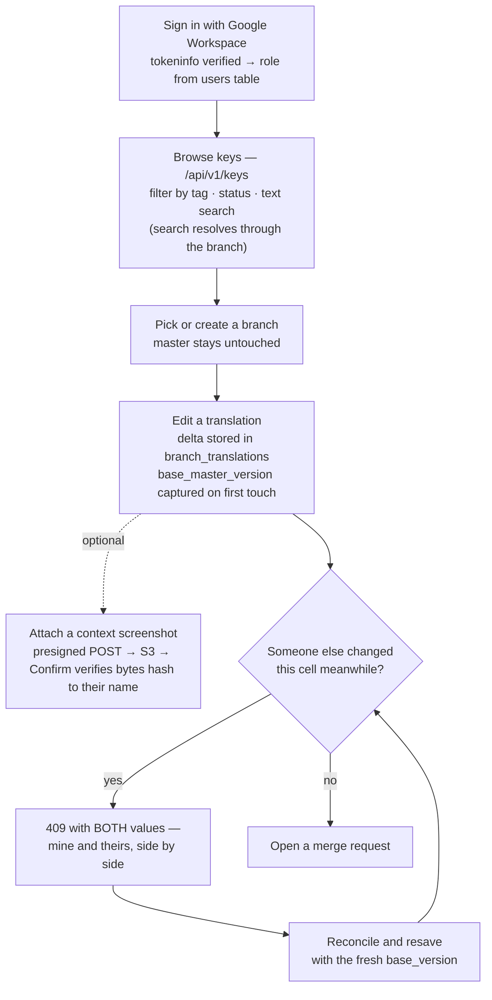
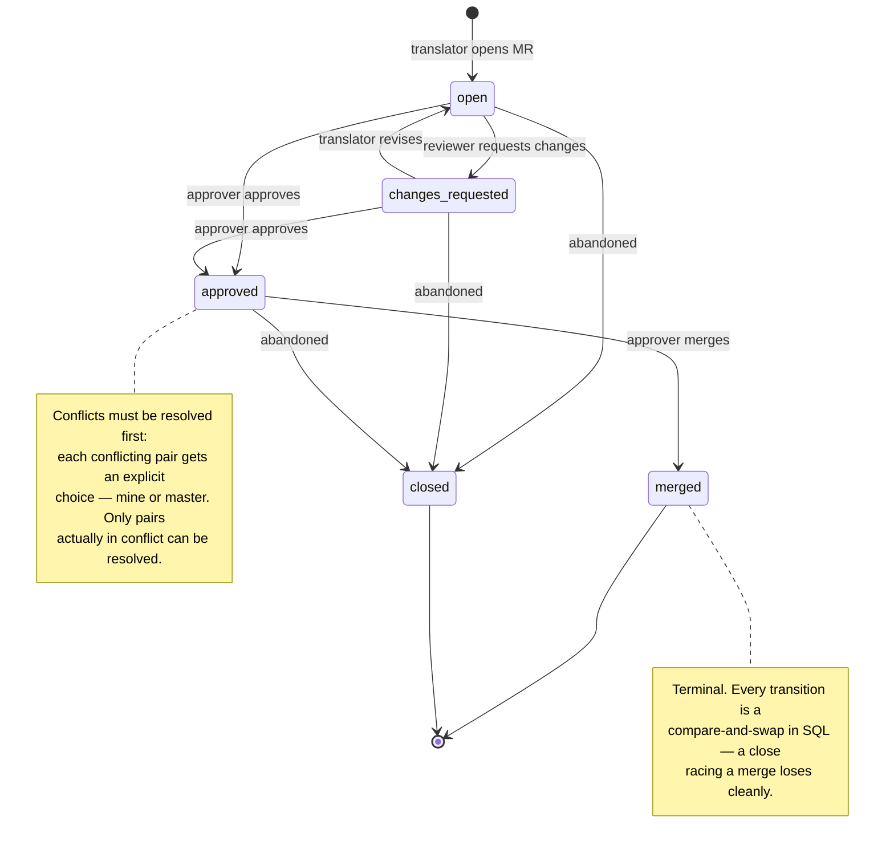
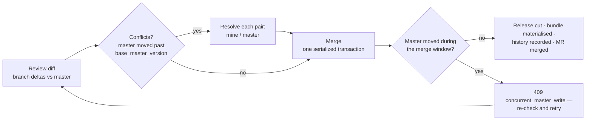
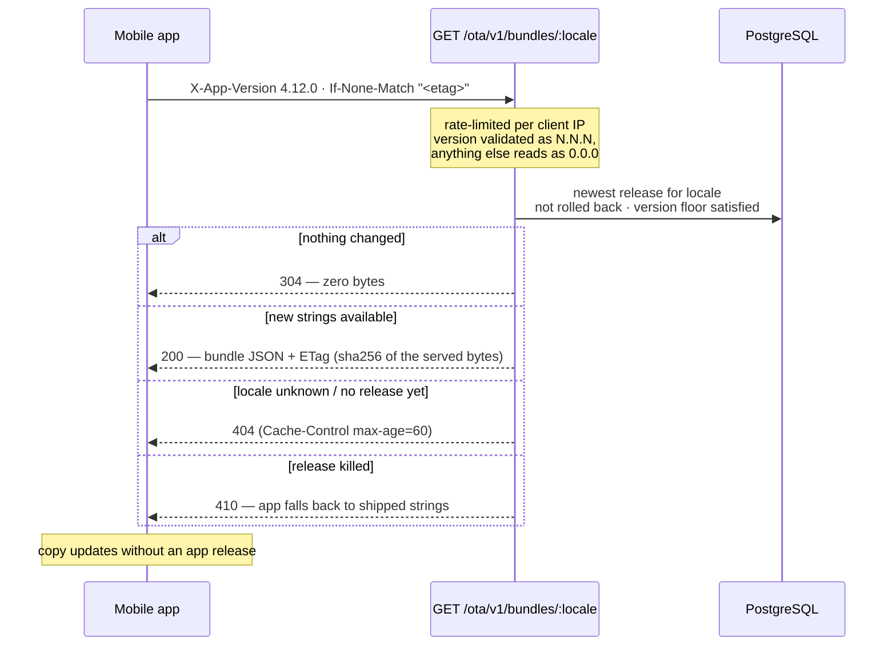
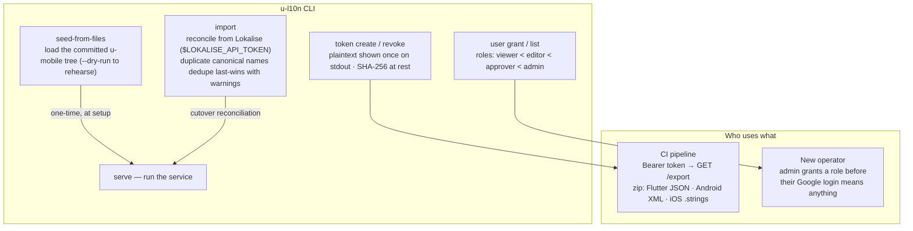

# u-l10n — user flows

Who touches the system, and what their path through it looks like. Companion to [ARCHITECTURE.md](ARCHITECTURE.md), which shows the machinery underneath.

## 1. Translator — editing copy

Three states matter while editing: **no value** (untranslated — omitted from exports), **empty** (deliberately blank — exported as `""`), and **translated**. Clearing a value and deleting it are different actions with different outcomes.

## 2. Reviewer / approver — the merge request

## 3. Mobile app user — strings over the air

## 4. Operator — CLI and administration

### Where the flows meet

Translator edits land on a **branch**; the approver's **merge** is the only door to master; a merge **cuts a release**; the app's next launch **picks it up**. Nothing reaches users' screens without passing every gate in between — and each arrow above that crosses a trust boundary (login, token, version header, resolution choice) is validated on the server side, never assumed from the client.
