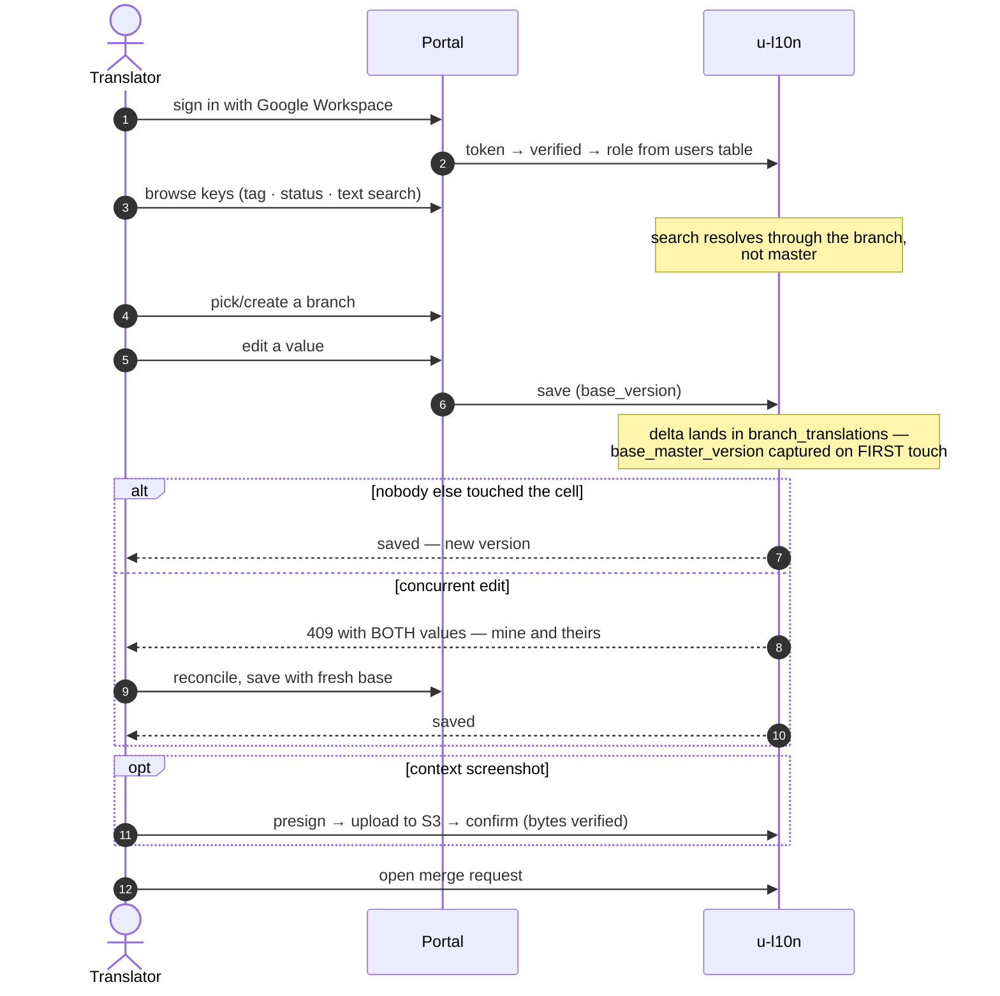
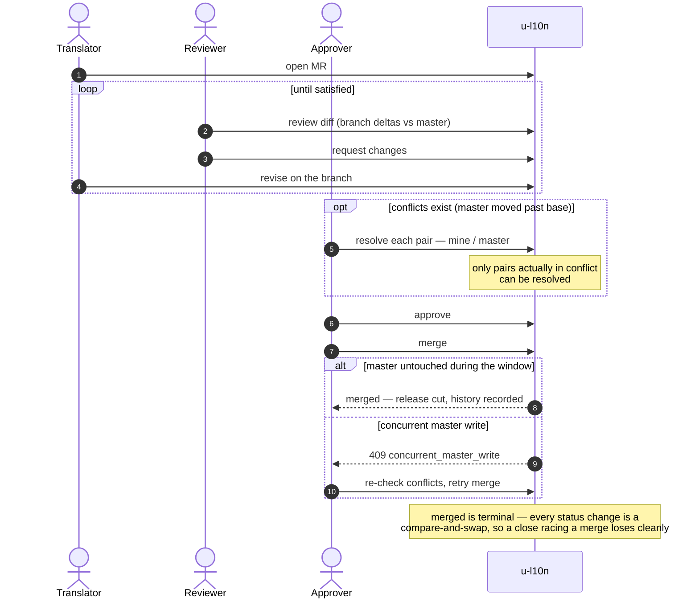
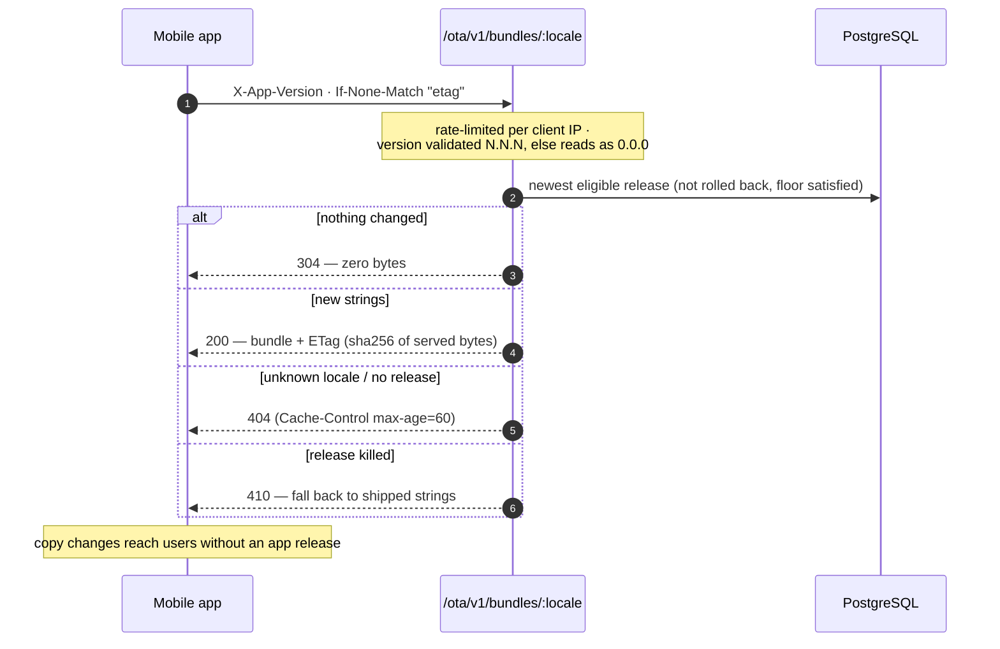
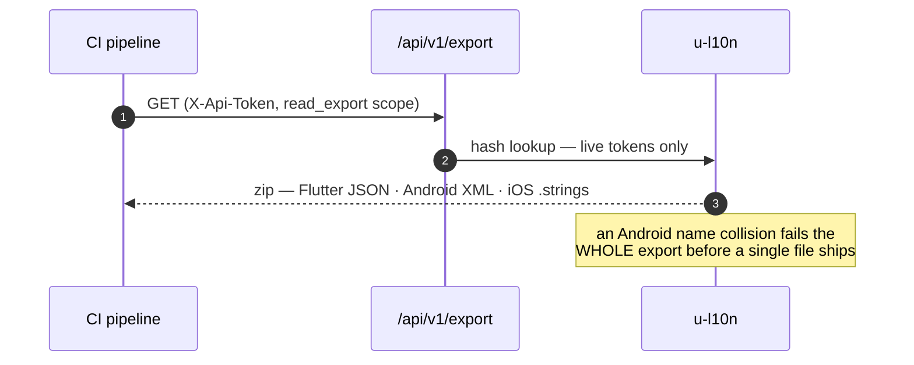

# u-l10n — user flows

One sequence per persona. Companion to [ARCHITECTURE.md](ARCHITECTURE.md), which shows the machinery underneath each arrow.

## 1. Translator — editing copy on a branch



Three states while editing: **no value** (untranslated — omitted from exports), **empty** (deliberately blank — exported as `""`), **translated**. Clearing and deleting are different actions.

## 2. Reviewer & approver — the merge request



## 3. Mobile app user — strings over the air



## 4. Operator — CLI administration

```mermaid
sequenceDiagram
    autonumber
    actor OP as Operator
    participant CLI as u-l10n CLI
    participant PG as PostgreSQL

    OP->>CLI: project create --code --name --actor
    CLI->>PG: projects row + actor's admin grant, ONE transaction
    Note over PG: platform admin only; the one privilege<br/>with no project to scope it to
    OP->>CLI: user grant --email --role [--platform-admin]
    CLI->>PG: users row (viewer < editor < approver < admin)
    Note over PG: a Google login means nothing<br/>until a role exists here
    OP->>CLI: token create --name --scope
    CLI->>PG: SHA-256 at rest
    CLI-->>OP: plaintext shown ONCE on stdout
    OP->>CLI: seed-from-files (--dry-run to rehearse)
    CLI->>PG: one-time load of the committed u-mobile tree
    OP->>CLI: import (cutover reconciliation from Lokalise)
```

## 5. CI — pulling the release formats



### Where the flows meet

Translator edits land on a **branch**; the approver's **merge** is the only door to master; a merge **cuts a release**; the app's next launch **picks it up**. Every arrow that crosses a trust boundary — login, token, version header, resolution choice — is validated server-side, never assumed from the client.
